# System Architecture

Diagram built from source code only (no inference, no documentation nodes). Every node and edge maps directly to code in the repository.

## Mermaid diagram

```mermaid
flowchart TB
    %% =========================================================
    %% 1. CS:SOURCE SERVER
    %% =========================================================
    subgraph SRV["CS:Source Dedicated Server"]
        SRVSCRIPT["start_css_server.sh"]

        subgraph TICKRATE["sourcemod/tickrate_enabler_src/serverplugin_empty.cpp"]
            CEMPTY["CEmptyServerPlugin\n: IServerPluginCallbacks, IGameEventListener"]
            GETTICK["GetTickInterval()\nhooks engine tick rate → 100 Hz"]
            GAMEFRAME["GameFrame()"]
            CEMPTY --> GETTICK
            CEMPTY --> GAMEFRAME
        end

        subgraph SM["SourceMod (loads .smx plugins)"]
            %% ---- cs_aim_live_controller.sp ----
            subgraph LIVE["sourcemod/cs_aim_live_controller.sp"]
                AIMMODE["AimMode enum\nRaw=0 · Smooth=1 · Humanised=2 · HumanisedHigh=3"]
                SMCVARS["ConVars: sm_nativeaim_mode / sm_nativeaim_active\nsm_nativeaim_fov / sm_nativeaim_smooth_gain\nsm_nativeaim_reaction_ms / sm_nativeaim_jitter_deg\n+ humanised_high tuning cvars"]
                FINDTGT["FindBestTarget(client, fov)\n→ best enemy index"]
                GETAIM["ComputeAngleToPoint()\nAngleDelta() / NormalizeYaw() / ClampPitch()"]
                ONCMD_LIVE["OnPlayerRunCmd(client, angles[])\nmodifies angles[] in-place each tick"]
                AIMMODE --> ONCMD_LIVE
                SMCVARS --> ONCMD_LIVE
                FINDTGT --> GETAIM --> ONCMD_LIVE
            end

            %% ---- cs_aim_override.sp ----
            subgraph OVR["sourcemod/cs_aim_override.sp"]
                TCP27020["SocketCreate/Bind/Listen\n127.0.0.1:27020 (TCP)"]
                ONCOMING["OnSocketIncoming()\n→ g_hClientSocket"]
                PARSEAIM["OnSocketReceive() → ParseAimPayload()\ng_fPendingYaw / g_fPendingPitch / g_bHasPending"]
                LASTANG["g_fLastYaw / g_fLastPitch / g_bHasLast\n(re-used when no new packet this tick)"]
                ONCMD_OVR["OnPlayerRunCmd(client, angles[])\nif sm_aim_override_active → apply pending/last angles"]
                TCP27020 --> ONCOMING --> PARSEAIM --> LASTANG --> ONCMD_OVR
            end

            %% ---- cs_aim_telemetry.sp ----
            subgraph TELEM_SM["sourcemod/cs_aim_telemetry.sp"]
                SMTGT["sm_telemetry_me / sm_telemetry_target\n→ g_iTargetPlayer"]
                HBTIMER["CreateTimer(0.5, Timer_Heartbeat, TIMER_REPEAT)\n→ {type:heartbeat, tick, health, armor, kills, deaths}"]
                HOOKEVT["HookEvent:\nplayer_death → {type:kill, attacker, victim, weapon, headshot}\nweapon_fire → {type:weapon_fire, shooter, weapon, position, view_angles}\nplayer_hurt → {type:player_hurt, attacker, victim, damage, hitgroup}\nround_start → {type:round_start, tick}\nround_end → {type:round_end, tick, winner}"]
                ONCMD_TEL["OnPlayerRunCmd(client, angles[])\n→ {type:tick, tick, timestamp_server, player_id,\n   position, eye_position, velocity,\n   view_angles:[pitch,yaw], buttons:{fire,jump,duck,\n   walk,forward,back,left,right},\n   enemies:[{id, origin, aim_position, velocity, visible, health}]}"]
                CANSEE["CanSeeTarget(client, targetPos)\nTR_TraceRayFilterEx → line-of-sight bool"]
                SENDJSON["SendJSON(json)\nSteamWorks_CreateHTTPRequest(POST)\n→ http://127.0.0.1:3000/event"]
                SMTGT --> ONCMD_TEL
                HBTIMER --> SENDJSON
                HOOKEVT --> SENDJSON
                ONCMD_TEL --> CANSEE
                ONCMD_TEL --> SENDJSON
            end
        end

        SRVSCRIPT --> TICKRATE
        TICKRATE --> SM
    end

    %% =========================================================
    %% 2. PYTHON CAPTURE LAYER
    %% =========================================================
    subgraph CAPTURE["Python Capture — capture/"]

        subgraph ORCH["session_orchestrator.py"]
            RUNSESS["run_session(argv)\nparse_args → player_id, label, duration"]
            BSN["build_session_name(player_id, label)\n→ '{pid}_{label}_{unix_ts}'"]
            ISBOT["is_bot_session(label)\n→ label in BOT_LABELS"]
            ISNATIVE["is_sm_native_session(label)\n→ label in SM_NATIVE_LABELS"]
            BOTQ["bot_queue = Queue(maxsize=1)\nif is_bot_session else None"]
            MAINLOOP["Main loop (0.5 s sleep)\ncount_ticks(app) / count_heartbeats(app)\ntick watchdog (warn) / hb watchdog (abort @30s)\nauto-stop after first-tick + duration"]
            GENMAN["generate_manifest(session_name, events_path, diagnostics)\n→ tick_count, estimated_hz, realtime_ratio\n   weapon_fires, kills, rounds, flags\n→ sessions/<session>_manifest.json"]
            RUNSESS --> BSN --> ISBOT --> BOTQ
            RUNSESS --> ISNATIVE
            RUNSESS --> MAINLOOP
            MAINLOOP --> GENMAN
        end

        subgraph FLASK["telemetry_server.py"]
            CREATEAPP["create_app(session_name, bot_queue)\n→ Flask app"]
            RUNSERVER["run_server(app, port=3000)\nFlask.run(threaded=True)"]
            EVENTPOST["/event POST handler\nEVENTS.append(data)\nif tick → put_latest(bot_queue, data)"]
            PUTLATEST["put_latest(q, item)\ndrain queue then insert newest tick\n(prevents stale-tick backlog)"]
            SORTDEDUP["_sort_and_dedupe(events)\nsort by (tick, timestamp_server, type)\ndedupe: per-tick types by (tick,type)\ndiscrete events by full JSON fingerprint"]
            SAVEEVT["save_events(app, output_dir='sessions')\n→ sessions/<session>_events.json"]
            GETEVTS["get_events(app) → EVENTS list\n(used by count_ticks / count_heartbeats)"]
            CREATEAPP --> RUNSERVER
            EVENTPOST --> PUTLATEST
            EVENTPOST --> GETEVTS
            SORTDEDUP --> SAVEEVT
        end

        subgraph BOT["bot_aim_generator.py"]
            BAGRUN["BotAimGenerator.run(bot_queue, stop_event)\ntick_data = bot_queue.get(timeout=1)"]
            SELTGT["select_target(enemies, player_pos, player_angles, priority)\n→ nearest / closest_to_crosshair / lowest_health"]
            ANGTGT["angle_to_target(player_pos, angles, target_pos)\nnormalize_yaw / angle_delta\n→ target_yaw, target_pitch"]
            SMOOTHHUM["Apply mode math:\nRaw: direct angles\nSmooth: gain lerp\nHumanised: reaction delay, jitter, overshoot, drift"]
            TCPSEND["socket.connect('127.0.0.1', 27020)\nsend '{yaw},{pitch}\\n' via TCP"]
            BAGRUN --> SELTGT --> ANGTGT --> SMOOTHHUM --> TCPSEND
        end

        RUNSESS --> CREATEAPP
        RUNSESS --> MAINLOOP
        ISBOT -->|"yes: resolve_bot_profile → load_config\n→ BotAimGenerator thread"| BAGRUN
        MAINLOOP --> SAVEEVT
        MAINLOOP -.->|"stop_event.set()"| BAGRUN
        PUTLATEST --> BAGRUN
        GETEVTS --> MAINLOOP
        SAVEEVT --> GENMAN
    end

    %% =========================================================
    %% Cross-layer connections
    %% =========================================================
    SENDJSON -->|"HTTP POST 127.0.0.1:3000/event"| EVENTPOST
    TCPSEND -->|"TCP 127.0.0.1:27020"| TCP27020

    %% =========================================================
    %% 3. SESSION OUTPUT FILES
    %% =========================================================
    DISK[("sessions/\n&#60;pid&#62;_&#60;label&#62;_&#60;ts&#62;_events.json\n  → [{type, tick, timestamp_server, ...}]\n&#60;pid&#62;_&#60;label&#62;_&#60;ts&#62;_manifest.json\n  → {tick_count, hz, fires, flags, diagnostics}")]
    SAVEEVT --> DISK
    GENMAN --> DISK

    %% =========================================================
    %% 4. ANALYSIS PIPELINE
    %% =========================================================
    subgraph ANALYSIS["Analysis Pipeline — analysis/"]

        subgraph LABELS["labels.py"]
            PARSESFN["parse_session_filename(path)\nregex: ^(pid)_(label)_(ts)_events\\.json$\n→ SessionMeta(path, participant_id, label, timestamp)"]
            DISCSES["discover_sessions(root, recursive, exclude_dirs, allowed_labels)\n→ list[SessionMeta]"]
            CONSTS["FINAL_STUDY_LABELS = ('human', 'sm_native_smooth', 'sm_native_humanised_high')\nMULTICLASS_LABEL_TO_ID = {human:0, sm_native_smooth:1, sm_native_humanised_high:2}\nTASK_LABELS = {binary_all, binary_smooth, binary_humanised, multiclass}\nlabel_mapping(task) → {label: class_idx}\nlabels_for_task(task) → tuple[str]"]
            PARSESFN --> DISCSES
            CONSTS --> DISCSES
        end

        DISK --> DISCSES

        subgraph PREP["preprocess_sequences.py"]
            PREPCFG["PreprocessConfig\nsessions_dir, window_start=-2.0, window_end=0.0\nseq_len=200, feature_set='aim_plus_movement'\nweapon=ak47, min_coverage=0.80\nmin_ticks, min_duration, min_tickrate"]
            EXTTICKS["_extract_ticks(events)\nAIM_FEATURES: yaw_delta, pitch_delta, yaw/pitch_speed\nyaw/pitch/angular_accel, yaw/pitch_jerk, angular_speed\nMOVEMENT_FEATURES: player/horiz/vertical_speed, player_accel\nbutton_forward/back/left/right/jump/duck/fire, is_moving, is_airborne\nTARGET_FEATURES: enemy counts, distances, target_yaw/pitch/angular_error\ntarget_distance, target_visible, target_health, target_speed, target_id_change"]
            SESSIONGATE["_session_exclusion_reason(meta, manifest, diag, cfg)\ngate: FINAL_STUDY_LABELS, min_ticks, min_duration\nmin_tickrate, weapon_fires > 0"]
            WINLOOP["weapon_fire anchor loop\nfilter: weapon == ak47\nwindow [anchor-2.0s, anchor+0.0s]\ncoverage ≥ 0.80, no large gaps\nno round boundary, angular_speed ≤ 5000°/s"]
            INTERPWIN["_interpolate_window(arr, feature_names, anchor_time,\n  window_start, window_end, seq_len=200, fill_values)\nnp.interp onto uniform grid → X [200, n_features] float32"]
            NPZOUT["np.savez_compressed\nanalysis/processed/windows_{config}.npz\n  X [N, 200, n_features], y_binary, y_multiclass\n  sample_ids, feature_names, config"]
            CSVOUT["analysis/processed/windows_{config}_metadata.csv\nsample_id, participant_id, session_name, condition\nbinary_label, multiclass_label, anchor_timestamp\nweapon, visible_enemy_at_fire, target_error_at_fire"]
            PREPCFG --> EXTTICKS --> SESSIONGATE --> WINLOOP --> INTERPWIN --> NPZOUT
            INTERPWIN --> CSVOUT
        end

        DISCSES --> PREPCFG

        subgraph SEQDATA["sequence_dataset.py"]
            LSD["load_sequence_data(data_path, metadata_path, task)\nload NPZ + CSV, filter rows by task labels\n→ SequenceData"]
            SEQDATAOBJ["SequenceData\nX [N, seq_len, n_channels], y [N]\nmetadata: list[dict], feature_names, task\nclass_names, sample_ids\n.participants / .sessions / .conditions"]
            AIMDS["AimSequenceDataset(X, y)\ntorch.utils.data.Dataset\n__getitem__ → (X[i] float32, y[i] int64)"]
            LSD --> SEQDATAOBJ
            LSD --> AIMDS
        end

        NPZOUT --> LSD
        CSVOUT --> LSD

        subgraph SPLITS["make_splits.py"]
            MAKELOPO["make_lopo_splits(participants, sessions, seed)\nfor each unique participant as test_pid:\n  random val_pid from remaining\n  train = rest; asserts disjoint(train,val,test)\n→ list[{fold, held_out_participant,\n   validation_participant, train/val/test_idx}]"]
            SAVESPL["save_splits(splits, out_path)\n→ fold_splits.json"]
            MAKELOPO --> SAVESPL
        end

        SEQDATAOBJ --> MAKELOPO

        subgraph MODEL["transformer_model.py  —  AimTransformerEncoder"]
            TRANSCFG["TransformerConfig\nn_channels, n_classes, seq_len=200\nd_model=64, n_heads=4, n_layers=2\ndim_feedforward=128, dropout=0.1\npooling='cls', conv_kernel=0"]
            INPUTPROJ["input_proj: Linear(n_channels → d_model)\nOR stem: Conv1d(n_channels, d_model, kernel, stride) + GELU"]
            CLSTOK["cls_token: Parameter(zeros(1,1,d_model))\nnn.init.trunc_normal_(std=0.02)\nprepend → h = cat([cls, h], dim=1)"]
            SINPE["SinusoidalPositionalEncoding(d_model, max_len=4096)\npe[:,0::2]=sin(pos·div); pe[:,1::2]=cos(pos·div)\nforward: x + pe[:, :x.shape[1]]"]
            ENCSTACK["nn.TransformerEncoder\nn_layers × TransformerEncoderLayer(\n  d_model, n_heads, dim_feedforward\n  activation=GELU, norm_first=True\n  batch_first=True)"]
            LNORM["LayerNorm(d_model)"]
            LINHEAD["Linear(d_model → n_classes)\n→ logits [batch, n_classes]"]
            TRANSCFG --> INPUTPROJ --> CLSTOK --> SINPE --> ENCSTACK
            ENCSTACK -->|"pooling='cls': h[:,0]\nOR pooling='mean': h.mean(dim=1)"| LNORM --> LINHEAD
        end

        subgraph TRAIN["train_transformer.py  /  run_transformer.py"]
            TRAINCFG["TrainConfig\nepochs, batch_size, lr, weight_decay\npatience, seed, device, amp, grad_clip\nweighted_sampler, num_workers\n+ model hyperparams"]
            LOADSD["load_sequence_data → SequenceData"]
            MAKESPLITS2["make_lopo_splits(data.participants, data.sessions)"]
            BUILDMODEL["AimTransformerEncoder(TransformerConfig(\n  n_channels=X.shape[2], n_classes,\n  seq_len=X.shape[1], d_model, ...))"]
            CHANSCALER["ChannelScaler.fit(X[train_idx])\nmean/std per channel (ignore near-zero std)\n.transform(X) → scaled float32"]
            MAKELOADER["make_loader(X, y, batch_size, shuffle\n+ WeightedRandomSampler if weighted_sampler)"]
            RUNEPOCH["run_epoch(model, loader, loss_fn, device\noptimizer, GradScaler, amp_enabled, grad_clip)\nAMP autocast + scaler.scale/unscale/step\ngrad clip → model.parameters()\n→ (loss, y_true, probs)"]
            LOSSOPT["CrossEntropyLoss(weight=class_weights(y_train, n_classes))\nAdamW(lr, weight_decay)\ntorch.amp.GradScaler('cuda')"]
            TUNETHRESH["tune_threshold(y_val, probs)\nscan thresholds [0.05..0.95, step 0.01]\nF1-macro maximising → best_threshold (binary only)"]
            EARLYSTOP["early stopping: bad_epochs ≥ patience\nsave best_state / best_threshold / best_val_f1"]
            FOLDMET["fold_metrics(y_test, probs, class_names, threshold)\naccuracy, balanced_accuracy\nprecision/recall/f1 macro & weighted\nROC-AUC (binary) / ROC-AUC-OVR-macro (multi)\nconfusion_matrix, per_class {p, r, f1, support}"]
            CKPT["torch.save checkpoint\ncheckpoints/fold_NN_PID.pt\n→ state_dict, scaler mean/std\n   model_config, train_config\n   best_threshold, best_val_f1"]
            AGGMET["aggregate_metrics(folds)\nmean ± std over all LOPO folds"]
            TRAINCFG --> LOADSD --> MAKESPLITS2
            MAKESPLITS2 --> CHANSCALER --> MAKELOADER --> RUNEPOCH
            BUILDMODEL --> RUNEPOCH
            LOSSOPT --> RUNEPOCH
            RUNEPOCH --> TUNETHRESH --> EARLYSTOP --> FOLDMET --> CKPT
            FOLDMET --> AGGMET
        end

        MAKELOPO --> MAKESPLITS2
        SEQDATAOBJ --> CHANSCALER
        TRANSCFG --> BUILDMODEL
        LINHEAD -->|"logits → loss"| RUNEPOCH

        RESULTS[("analysis/results/&#60;run_id&#62;/\nmetrics.json (fold + aggregate metrics)\nfold_predictions.csv (true_label, pred_tuned, prob_*)\nfold_splits.json\nconfusion_matrix.png\ntraining_curves.png\ncheckpoints/fold_NN_PID.pt")]
        AGGMET --> RESULTS
        CKPT --> RESULTS

        subgraph EVAL["evaluate_transformer.py"]
            READPREDS["_read_predictions(fold_predictions.csv)\n→ y_true [N], y_pred [N]"]
            PLOTCM2["plot_confusion(cm, class_names)\n→ confusion_matrix.png"]
            CLSREP["classification_report(y_true, y_pred)\n→ classification_report.txt"]
            READPREDS --> PLOTCM2
            READPREDS --> CLSREP
        end

        RESULTS --> READPREDS

        subgraph BASE["run_baselines.py"]
            FLATFEAT["Flatten X [N, seq_len, C] → aggregate feature vector\nBASELINE_FEATURES (15):\nmean/median/max/p95 angular_speed\ntotal_abs_yaw/pitch_movement, yaw/pitch_range\nyaw/pitch_direction_changes, mean/max_player_speed\nvisible_enemy_proportion, mean_target_error\ntarget_error_at_fire"]
            BASEPIPES["Pipelines (sklearn):\nDummyClassifier (most-frequent)\nLogisticRegression + StandardScaler\nRandomForestClassifier\nLinearSVC + StandardScaler\nGradientBoostingClassifier"]
            LOPO_BASE["LOPO CV (make_lopo_splits)\nper-fold: fit on train, score on test\n→ accuracy, balanced_acc, F1, ROC-AUC"]
            BASEOUT["analysis/results/ak47_baselines_*/\nmetrics.json, fold_predictions.csv\nconfusion matrices per classifier"]
            FLATFEAT --> BASEPIPES --> LOPO_BASE --> BASEOUT
        end

        SEQDATAOBJ --> FLATFEAT
        MAKELOPO --> LOPO_BASE
    end
```

## Component → source map

| Stage | Primary source |
|---|---|
| Server startup | `start_css_server.sh` |
| 100 Hz tickrate gate | `sourcemod/tickrate_enabler_src/serverplugin_empty.cpp` → `Tickrate_Enabler.so` |
| SM-native aim controller | `sourcemod/cs_aim_live_controller.sp` → `cs_aim_live_controller.smx` |
| TCP angle override receiver | `sourcemod/cs_aim_override.sp` → `cs_aim_override.smx` |
| Per-tick telemetry emission | `sourcemod/cs_aim_telemetry.sp` → `cs_aim_telemetry.smx` |
| Flask telemetry receiver | `capture/telemetry_server.py` |
| Session orchestrator | `capture/session_orchestrator.py` |
| Python bot angle generator | `capture/bot_aim_generator.py` |
| Session output files | `sessions/<pid>_<label>_<ts>_events.json`, `_manifest.json` |
| Label parsing | `analysis/labels.py` |
| Sequence preprocessing | `analysis/preprocess_sequences.py` |
| Dataset loader | `analysis/sequence_dataset.py` |
| LOPO splits | `analysis/make_splits.py` |
| Transformer architecture | `analysis/transformer_model.py` |
| Transformer training + eval | `analysis/train_transformer.py`, `analysis/run_transformer.py` |
| Post-hoc evaluation | `analysis/evaluate_transformer.py` |
| Classical baselines | `analysis/run_baselines.py` |

## Architecture notes

- **Two aim injection modes:**
  - *SM-native* (`sm_native_*` labels): `cs_aim_live_controller.sp` runs the full aim loop (FindBestTarget → ComputeAngleToPoint → humanisation math) entirely inside the CS:Source engine process via `OnPlayerRunCmd()`. No Python process is involved.
  - *Bot* (`bot_*` labels): `capture/bot_aim_generator.py` reads tick data from the Flask `bot_queue`, computes angles, and sends them via TCP to `cs_aim_override.sp` which applies them in `OnPlayerRunCmd()`.
- **Telemetry is always active** regardless of aim mode. `cs_aim_telemetry.sp` POSTs every tick, heartbeat, kill, weapon fire, hurt, and round boundary to `http://127.0.0.1:3000/event` via SteamWorks HTTP.
- **`put_latest()` in `telemetry_server.py`** deliberately drops all but the newest tick from the bot queue so `BotAimGenerator` never acts on stale game state.
- **`_sort_and_dedupe()`** in `telemetry_server.py` corrects HTTP arrival-order jitter from the SteamWorks async client before writing `events.json`.
- **Preprocessing (`preprocess_sequences.py`)** extracts fixed-length windows anchored on `weapon_fire` events, interpolated to a uniform 200-tick grid in the range `[-2.0 s, 0.0 s]`. Feature set is `aim_plus_movement` (23 channels). Target-aware, outcome, and participant-ID features are not included in the primary model input.
- **LOPO split (`make_lopo_splits`)** holds out one participant per fold as test, picks a random validation participant from the remainder, trains on the rest. Train/val/test sets are asserted disjoint at participant level.
- **`ChannelScaler`** is fit on training participants only and applied to val/test, preventing data leakage.
- **`AimTransformerEncoder`** (encoder-only): Linear projection → CLS token prepend → Sinusoidal PE → TransformerEncoder (norm_first=True, GELU, batch_first=True) → LayerNorm → Linear head. CLS token representation used for classification.
- **Threshold tuning** in `train_transformer.py` scans [0.05 … 0.95] on the validation set to maximise macro F1 (binary tasks only).
- **Classical baselines** (`run_baselines.py`) flatten each 200-tick window to 15 aggregate statistics and evaluate Dummy, LR, RF, LinearSVC, and GradientBoosting classifiers under the same LOPO protocol.
