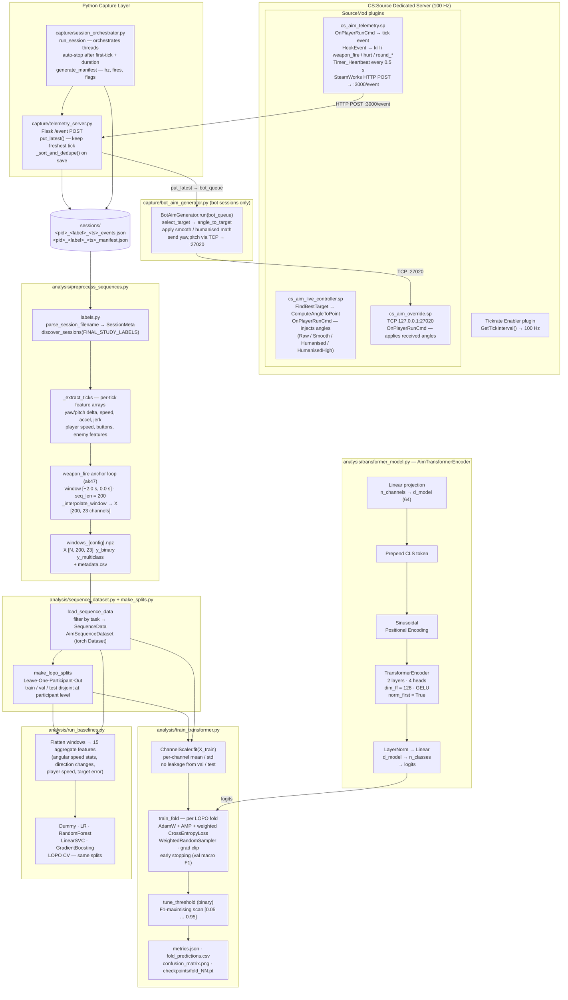

# System Architecture — Dissertation Figure

```mermaid
flowchart TB
    %% ── Server ─────────────────────────────────────────────────
    subgraph SRV["CS:Source Dedicated Server  (100 Hz)"]
        direction TB
        TICK["Tickrate Enabler plugin\nGetTickInterval() → 100 Hz"]

        subgraph SM["SourceMod plugins"]
            LIVE["cs_aim_live_controller.sp\nFindBestTarget → ComputeAngleToPoint\nOnPlayerRunCmd — injects angles\n(Raw / Smooth / Humanised / HumanisedHigh)"]
            OVR["cs_aim_override.sp\nTCP 127.0.0.1:27020\nOnPlayerRunCmd — applies received angles"]
            TEL["cs_aim_telemetry.sp\nOnPlayerRunCmd → tick event\nHookEvent → kill / weapon_fire / hurt / round_*\nTimer_Heartbeat every 0.5 s\nSteamWorks HTTP POST → :3000/event"]
        end
    end

    %% ── Python bot (bot_* sessions only) ───────────────────────
    subgraph BOT["capture/bot_aim_generator.py  (bot sessions only)"]
        direction LR
        BAG["BotAimGenerator.run(bot_queue)\nselect_target → angle_to_target\napply smooth / humanised math\nsend yaw,pitch via TCP → :27020"]
    end

    %% ── Capture ─────────────────────────────────────────────────
    subgraph CAP["Python Capture Layer"]
        direction TB
        FLASK["capture/telemetry_server.py\nFlask /event POST\nput_latest() — keep freshest tick\n_sort_and_dedupe() on save"]
        ORCH["capture/session_orchestrator.py\nrun_session — orchestrates threads\nauto-stop after first-tick + duration\ngenerate_manifest — hz, fires, flags"]
    end

    %% ── Disk ────────────────────────────────────────────────────
    DISK[("sessions/\n&lt;pid&gt;_&lt;label&gt;_&lt;ts&gt;_events.json\n&lt;pid&gt;_&lt;label&gt;_&lt;ts&gt;_manifest.json")]

    %% ── Preprocessing ───────────────────────────────────────────
    subgraph PREP["analysis/preprocess_sequences.py"]
        direction TB
        LAB["labels.py\nparse_session_filename → SessionMeta\ndiscover_sessions(FINAL_STUDY_LABELS)"]
        EXT["_extract_ticks — per-tick feature arrays\nyaw/pitch delta, speed, accel, jerk\nplayer speed, buttons, enemy features"]
        WIN["weapon_fire anchor loop (ak47)\nwindow [−2.0 s, 0.0 s] · seq_len = 200\n_interpolate_window → X [200, 23 channels]"]
        NPZ["windows_{config}.npz\nX [N, 200, 23]  y_binary  y_multiclass\n+ metadata.csv"]
        LAB --> EXT --> WIN --> NPZ
    end

    %% ── Dataset & splits ────────────────────────────────────────
    subgraph DATA["analysis/sequence_dataset.py  +  make_splits.py"]
        direction LR
        LSD["load_sequence_data\nfilter by task → SequenceData\nAimSequenceDataset (torch Dataset)"]
        SPL["make_lopo_splits\nLeave-One-Participant-Out\ntrain / val / test disjoint at participant level"]
    end

    %% ── Model ───────────────────────────────────────────────────
    subgraph MODEL["analysis/transformer_model.py  —  AimTransformerEncoder"]
        direction LR
        PROJ["Linear projection\nn_channels → d_model (64)"]
        CLS["Prepend CLS token"]
        PE["Sinusoidal\nPositional Encoding"]
        ENC["TransformerEncoder\n2 layers · 4 heads\ndim_ff = 128 · GELU\nnorm_first = True"]
        HEAD["LayerNorm → Linear\nd_model → n_classes\n→ logits"]
        PROJ --> CLS --> PE --> ENC --> HEAD
    end

    %% ── Training ────────────────────────────────────────────────
    subgraph TRAIN["analysis/train_transformer.py"]
        direction TB
        SCALER["ChannelScaler.fit(X_train)\nper-channel mean / std\nno leakage from val / test"]
        LOOP["train_fold — per LOPO fold\nAdamW + AMP + weighted CrossEntropyLoss\nWeightedRandomSampler · grad clip\nearly stopping (val macro F1)"]
        THRESH["tune_threshold (binary)\nF1-maximising scan [0.05 … 0.95]"]
        OUT["metrics.json · fold_predictions.csv\nconfusion_matrix.png · checkpoints/fold_NN.pt"]
        SCALER --> LOOP --> THRESH --> OUT
    end

    %% ── Baselines ───────────────────────────────────────────────
    subgraph BASE["analysis/run_baselines.py"]
        direction LR
        BFEAT["Flatten windows → 15 aggregate features\n(angular speed stats, direction changes,\nplayer speed, target error)"]
        BCLF["Dummy · LR · RandomForest\nLinearSVC · GradientBoosting\nLOPO CV — same splits"]
    end

    %% ── Edges ───────────────────────────────────────────────────
    TEL -->|"HTTP POST :3000/event"| FLASK
    BAG -->|"TCP :27020"| OVR
    FLASK -->|"put_latest → bot_queue"| BAG

    ORCH --> FLASK
    FLASK --> DISK
    ORCH --> DISK

    DISK --> LAB
    NPZ --> LSD
    LSD --> SPL
    SPL --> SCALER
    LSD --> SCALER
    HEAD -->|logits| LOOP
    SPL --> BFEAT
    LSD --> BFEAT
    BFEAT --> BCLF
```
